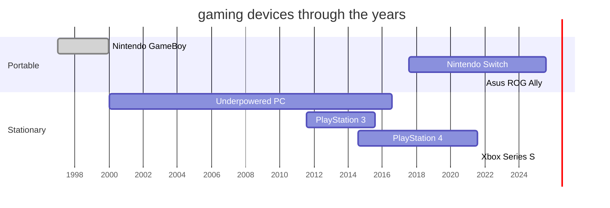

## Distant Past (2000-2011)

As a child, I did not have a video game console.

Well, technically I had a GameBoy with a single cartridge, but we almost never had batteries for it.
Plus I never got too far in that Dark Wing Duck game, the first boss proved to be too difficult for me.

So when in 2000 I got my first PC, it didn't take too long for a teenage me to discover the joy of video games.

It was never a powerful gaming PC, which explains why to this day I have a very high tolerance to low FPS.

And by *low* I mean around 15-20 FPS - that's how I played majority of the new games in my teens.

## PlayStation 3 (2011-2015)

I bought my very first console myself, around 2010 or 2011, after I already started working in IT.
The choice of **PlayStation 3** was dictated by a single game - **Daemon Souls**.

I read about it in a (printed!) gaming magazine, which described the unique experience it provided, and decided that it makes sense to pick PS3,
and not an Xbox 360, just to be able to play this unique RPG.

RPGs were my favourite genre, so it was only logical to go with the platform where I could try this brand new and unique game.
So I went with PS3 despite the known shortcomings of the Cell architecture and obviously subpar quality of the multi platform games there.

Overall I was pretty happy with it, at least it gave me access to a bunch of high quality Sony exclusives.

## PlayStation 4 (2014-2021)

It was the only logical step forward at the time, after the initial failure of Xbox One with Kinect.

I was not at all excited about the upgrade, but in general PS4 proved to be a much better platform, especially with much more adequate support for
the online store and internet connectivity in general.
Plus, the controllers became better too.

## Nintendo Switch (2017-2025)

As I've already mentioned, I didn't have a proper console growing up.
Which in turn meant that I never got to experience any of the Nintendo games.
Switched seemed like a good opportunity to do so, and a built-in support for couch co-op was a welcome bonus.

Me and my wife played countless hours of ModNation Racers on PS3, and now we got to play even more in Mario Kart 8.

Great device overall, despite some glaring shortcomings like exceptionally unreliable joysticks.
I replaced each at least twice in my JoyCons.

## Xbox Series S (2021-now)

I [was by no means excited about PS5](/post/2021/08/07/why-xbox/).

That's why I picked Xbox in 2021. This generation of Xbox, with GamePass and backward compatibility,
allowed me to experience the back catalogue of Xbox games very cheaply and comfortably.

It turned out to be a great little device, I have zero complaints. Plus, the controllers are way better than PS4 DualShock.

## Asus ROG Ally (2025-now)

Here I am, coming a full circle back to PC. I'll do a separate blog post on how I picked this device, but so far I'm very happy with it.
