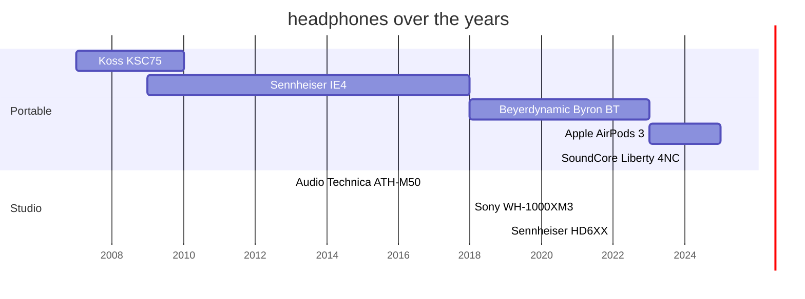

A list of my headphones, past and present.

My audiophile journey from 2000 to 2023 is described in details [in this post](/post/2023/05/01/hifi-audio/).

* &#x1F44C; **Koss Ear Clip KSC75** &#x274C; (2007-2009).
  I wanted a (then legendary) *Koss Porta Pro*, but didn't have the money. This was the next best thing I could find.
  Arguably it was a bad choice for my purposes, since the open nature of the headphones made them impractical to use on the subway.
* &#x1F9E1; **Sennheiser IE4** &#x274C; (2009-2017).
  My first proper choice of headphones, in a sense that I researched the market, read the reviews and selected this particular model.
  I was not disappointed, and they served me for years.
* &#x1F44E; **Beyerdynamic Byron BT** &#x274C; (2018-2022).
  Planned as a wireless replacement for IE4, to use while commuting to work.
  Sadly I never got to make it fit properly in my ears, regardless of that size tips I used.
  They still served me for a good few years, but I never got to love them.
* &#x1F9E1; **Audio Technica ATH-M50** (2013-).
  The GOAT! I still use them almost every day.
  I replaced the ear pads and put a cover on the headband, but the rest works just fine.
  The sound quality is great, significantly better than the noise-cancelling Sony I use for meetings.
* &#x1F44C; **Sony WH-1000XM3** (2018-).
  Originally meant as a wireless, noise-cancelling replacement for the ATH-M50, but never fulfilled this promise.
  Sadly the audio quality for music is noticeably worse than ATH-M50.
  I use them only for Zoom calls at work.
* &#x1F9E1;**Sennheiser HD6XX** (2019-).
  The real *luxury* for me. I rarely use them, only when I have the time to properly *listen* to an album or two.
  But when I do, I very much enjoy the sound and the soundstage they provide.
* &#x1F4A9;**Apple AirPods 3** &#x274C; (2023-2024).
  The plastic abomination which I got for free at work. Hurt my ears, never notified me that they are out of juice - pure overpriced garbage.
  In the end I couldn't even successfully unlink them from my Apple account to return, so they went right in the e-waste recycling bin.
* &#x1F44D;**SoundCore Liberty 4NC** (2024-).
  My go-to headphones for any day to day activity and travels. Noise cancellation works remarkably well, the sound is not bad either.
  Very happy with the headphones overall.
